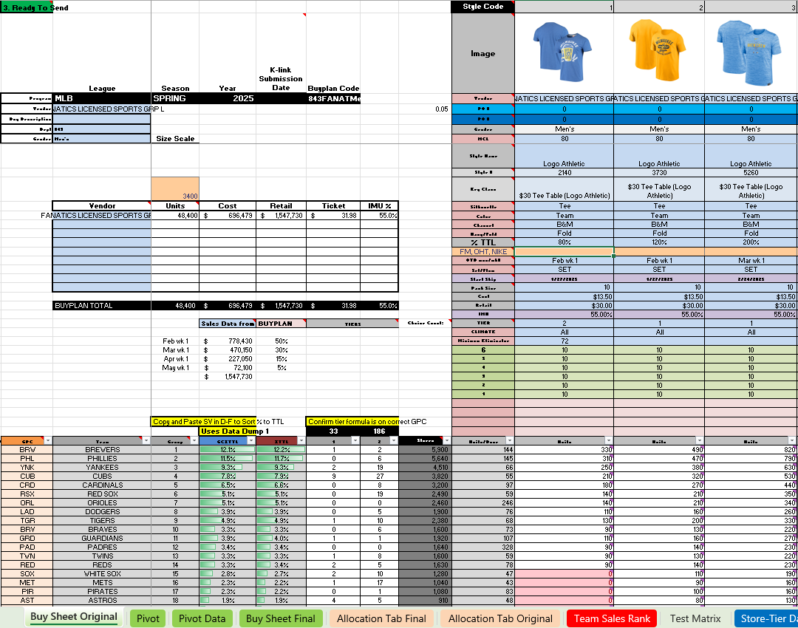
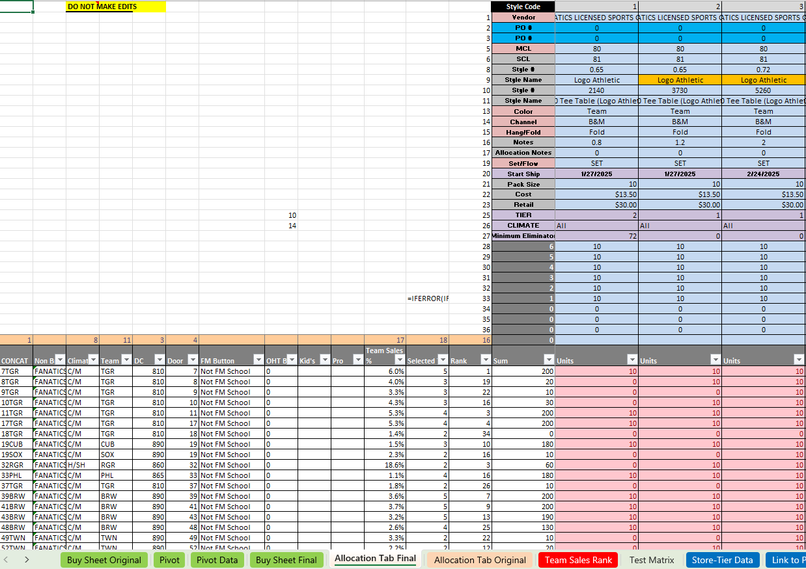

# Buying Office Buyplan Automation Template

This macro-enabled Excel tool automates seasonal merchandise purchasing for licensed team sports across hundreds of stores and teams. It combines sales forecasting, team performance, and tiered store segmentation to produce a data-driven buy plan optimized for replenishment and allocation.

---

## 📈 Dashboard Previews

### Buyplan Overview

---

### Allocation Matrix

---

## 🔹 Key Features

- Automated team/store-tier allocation logic
- Sales forecasting by week and team
- Dynamic buyplan + ticket price + IMU%
- Built-in pivot summary
- Store count elimination logic

---

## 🛠️ Technologies Used

- Excel Macros (VBA)
- Pivot Tables
- Data Validation
- Conditional Formatting
