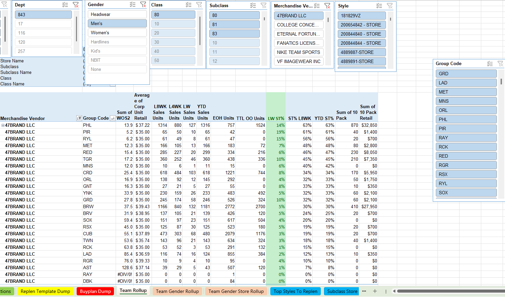
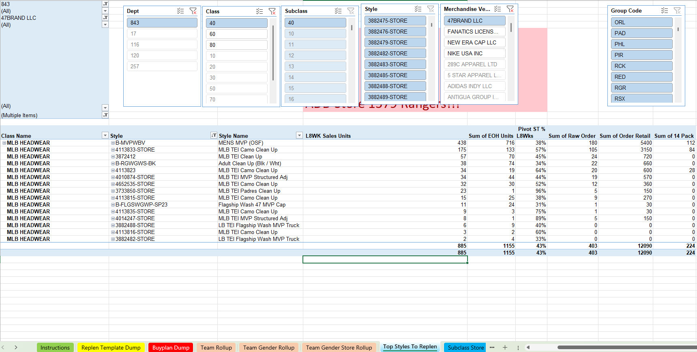

# Replenishment Report – Licensed Sports Product Chase Tool

This Excel tool identifies fast-selling licensed sports products to replenish, using live sales velocity, team/store level logic, and inventory status to generate weekly PO recommendations.

---

## 📈 Dashboard Previews

### Replenishment Pivot Dashboard

---

### Style-Level Chase Table

---

## 🔹 Key Features

- Sell-through % + L4/L8 week logic
- Style rank and elimination control
- Team/Gender/Subclass filters
- PO-ready unit suggestions

---

## 🛠️ Technologies Used

- Excel
- Pivot Tables
- INDEX-MATCH logic
- Manual data paste support
