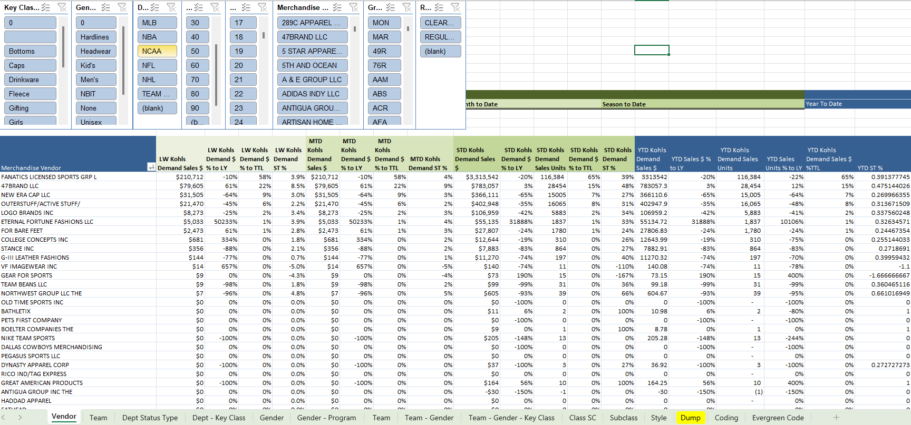
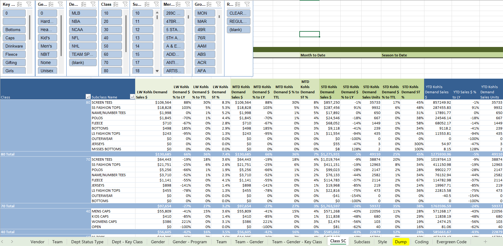

# Vendor & Category Recap Dashboard

This Excel-based reporting tool summarizes licensed team sports performance across vendors, categories, and styles — used for weekly business reviews and vendor strategy.

---

## 📈 Dashboard Previews

### Vendor-Level Summary

---

### Class-Level Breakdown

---

## 🔹 Key Features

- Vendor + Gender + Class + Subclass pivot views
- Evergreen classification logic
- Performance filters by timeframe
- Used for recaps, decks, and markdown calls

---

## 🛠️ Technologies Used

- Excel
- Pivot Tables
- Named Ranges
- Conditional Formatting
