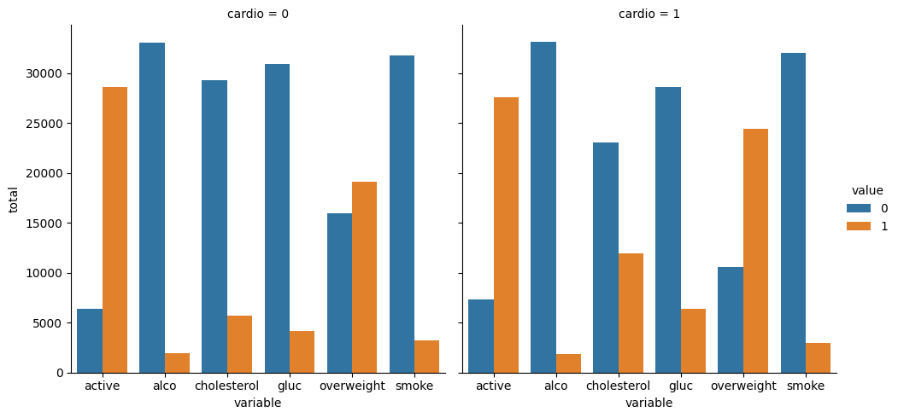
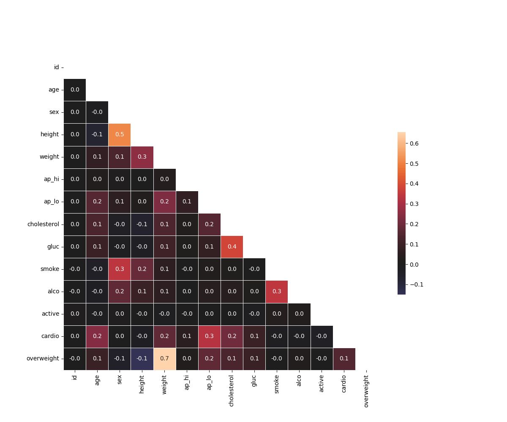

```markdown
# Medical Data Visualizer

This project uses Pandas, Seaborn, and Matplotlib to explore and visualize medical examination data. It includes a categorical plot and heatmap to identify correlations between health indicators such as cholesterol, BMI, glucose, and lifestyle factors.

---

## 🔹 Key Features

- Adds an `overweight` column using BMI calculations
- Normalizes cholesterol and glucose data (0 = good, 1 = bad)
- Creates two visualizations:
  - **Categorical Plot**: Compares distributions of health-related factors (e.g., smoking, alcohol use, activity) by cardiovascular condition
  - **Heatmap**: Shows correlations between medical variables after filtering outliers

---

## 🛠️ Technologies Used

- Python 3
- Pandas
- Seaborn
- Matplotlib

---

## 🚀 How to Run

1. Install dependencies:
   ```bash
   pip install pandas seaborn matplotlib
   ```

2. Run the script:
   ```bash
   python medical_data_visualizer.py
   ```

3. Output:
   - `catplot.png`: categorical comparison plot
   - `heatmap.png`: correlation heatmap

---

## 📋 Sample Output

### Categorical Plot



### Correlation Heatmap



---

## 📎 Project Files

- `medical_data_visualizer.py` – Core analysis and visualization logic
- `medical_examination.csv` – Dataset of patient medical records
- `test_module.py` – freeCodeCamp unit tests
- `requirements.txt` – Dependencies

---

## 📄 License

This project is licensed under the MIT License.

---

> *"Health insights are better visualized than guessed — this project makes the data speak."*
```
