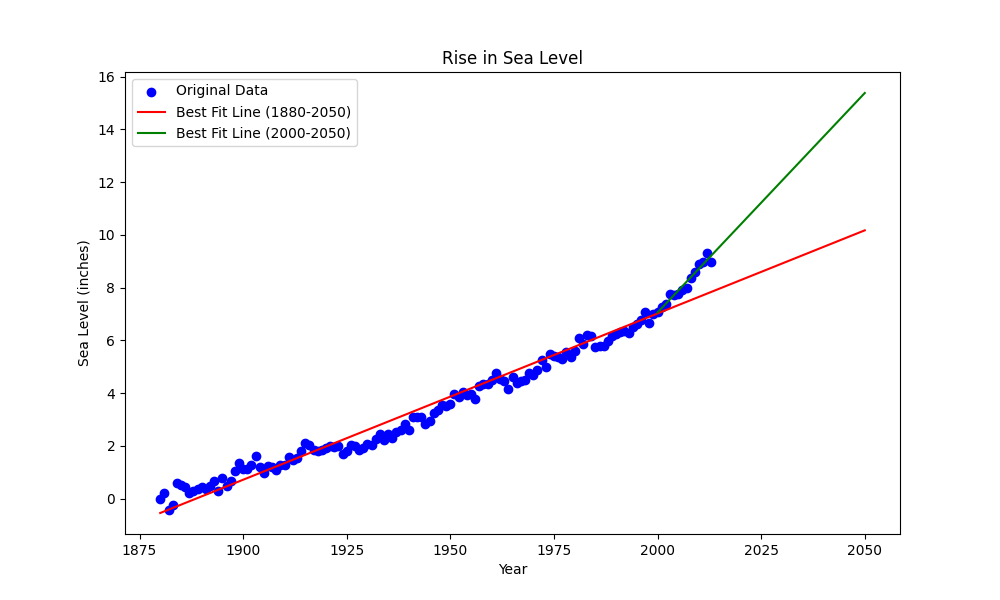

# Sea Level Predictor

This project analyzes historical sea level data to model long-term trends and forecast future sea levels using linear regression. It generates a plot showing historical data alongside two lines of best fit — one for all data and another from the year 2000 onward.

---

## 🔹 Key Features

- Reads global sea level data from 1880 to 2013
- Fits two linear regression models:
  - Full dataset (1880–2013)
  - Recent trend (2000–2013)
- Extends predictions to the year 2050
- Creates a visual plot of actual data and forecasted trends

---

## 🛠️ Technologies Used

- Python 3
- Pandas
- Matplotlib
- SciPy (for `linregress`)

---

## 🚀 How to Run

1. Install dependencies:
   ```bash
   pip install pandas matplotlib scipy
Let’s lock in a great `README.md` for your **Sea Level Predictor** project — clean, complete, and copy-pasteable:

2. Run the script:
   ```bash
   python sea_level_predictor.py
   ```

3. Output:
   - `sea_level_plot.png`: plot showing the historical data and predicted sea level rise through 2050

---

## 📋 Sample Output



---

## 📎 Project Files

- `sea_level_predictor.py` – Script for data processing, regression, and plotting
- `epa-sea-level.csv` – Source dataset from the U.S. Environmental Protection Agency
- `test_module.py` – Unit tests provided by freeCodeCamp
- `requirements.txt` – Dependency list

---

## 📄 License

This project is licensed under the MIT License.

---

> *"We can’t control the tides, but we can predict their rise — with code." 🌊*
