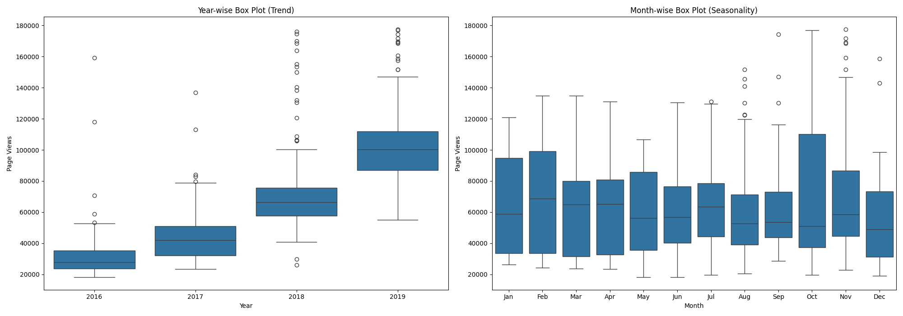

# Time Series Visualizer

This project analyzes forum page view data over time and creates a variety of visualizations to uncover trends, seasonal patterns, and outliers. It’s a great example of how to clean, reshape, and explore time series data using Pandas and Matplotlib.

---

## 🔹 Key Features

- Loads and cleans forum traffic data from a CSV file
- Generates three visualizations:
  - **Line Plot**: daily page views over time
  - **Bar Plot**: average monthly page views per year
  - **Box Plots**: distribution of page views by year and by month

---

## 🛠️ Technologies Used 

- Python 3
- Pandas
- Matplotlib
- Seaborn

---

## 🚀 How to Run

1. Install dependencies:
   ```bash
   pip install pandas matplotlib seaborn

2. Run the script
   ```bash
   python time_series_visualizer.py
   ```

3. Output:
   - `line_plot.png`: raw time series
   - `bar_plot.png`: average monthly views per year
   - `box_plot.png`: yearly and monthly distribution plots

---

## 📋 Sample Output

### Line Plot  


### Bar Plot  


### Box Plots  


---

## 📎 Project Files

- `time_series_visualizer.py` – Data prep and plotting logic
- `fcc-forum-pageviews.csv` – Time series dataset
- `test_module.py` – Unit tests provided by freeCodeCamp
- `requirements.txt` – Python dependencies

---

## 📄 License

This project is licensed under the MIT License.

---

> *"Time reveals all trends — you just need the right plot to see them."*
```

